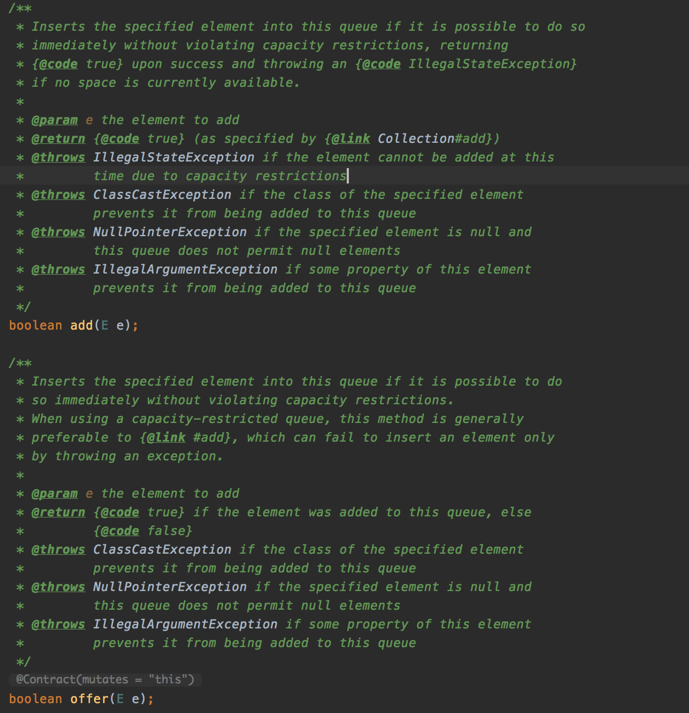
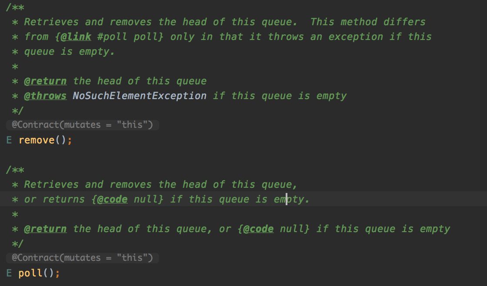
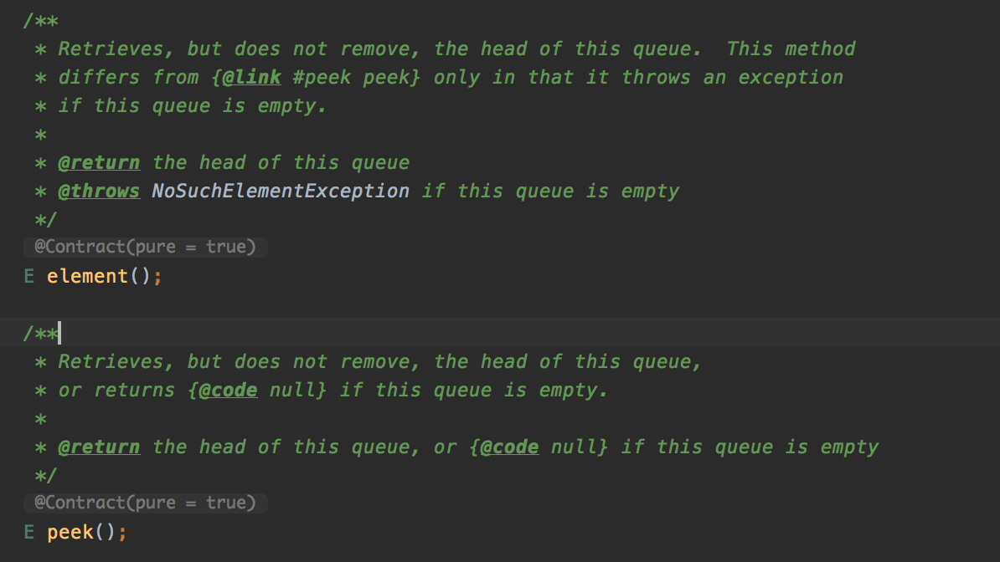

# 学习笔记

[Queue源码阅读](#Queue源码阅读)

[PriorityQueue源码阅读](#PriorityQueue源码阅读)

#### Queue源码阅读

- Queue代码结构(java.util包中)

- 添加元素add()和offer()，其区别主要体现在对控制大小下的返回，当大小不够时，add()会抛出IllegalStateException异常，而offer()会直接返回false

源码

- 删除元素remove()和poll()类似，其主要区别是在空队列情况下的返回，源码如下

- 返回队列的头元素element()和peek()，其主要区别也是在空队列情况下的返回，源码如下

