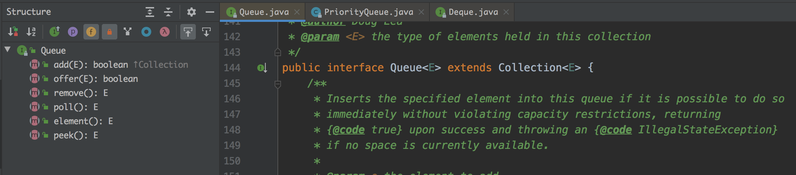
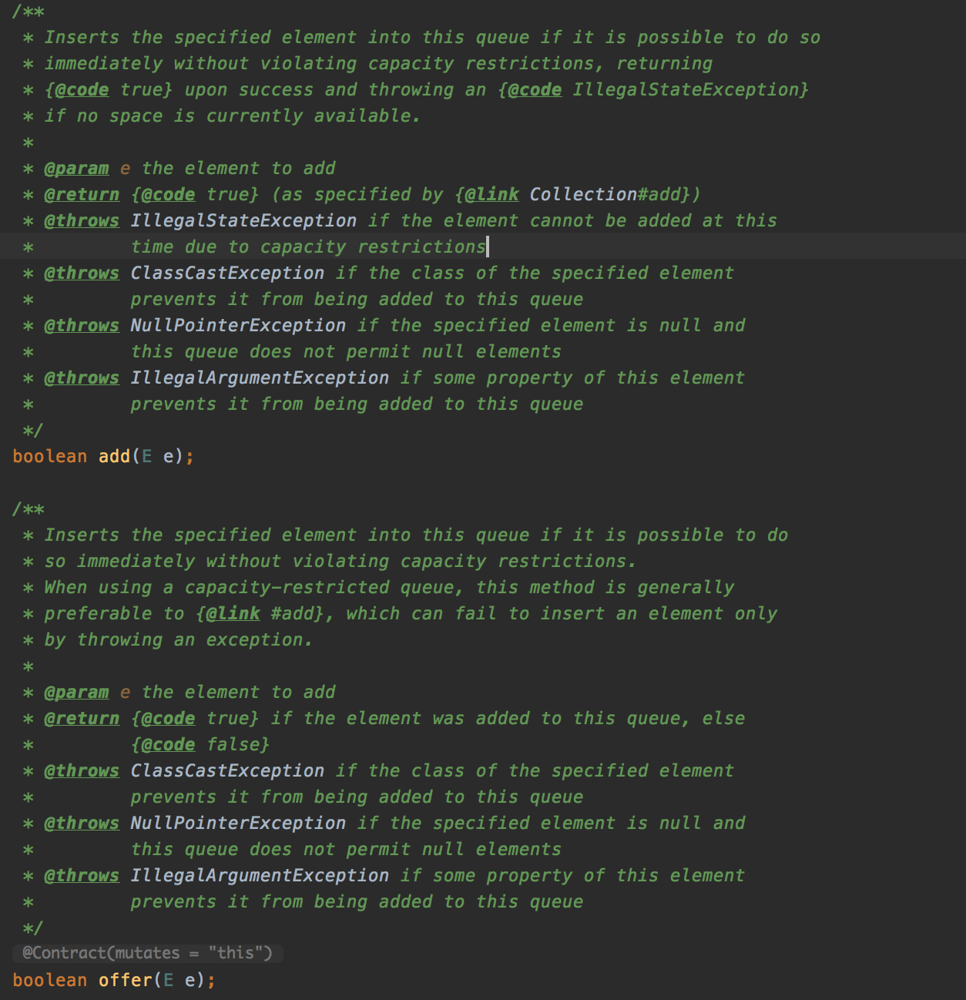
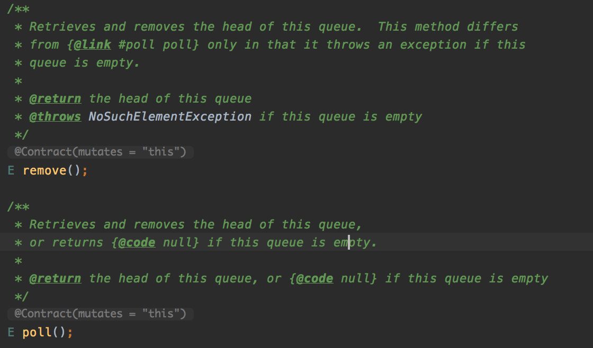
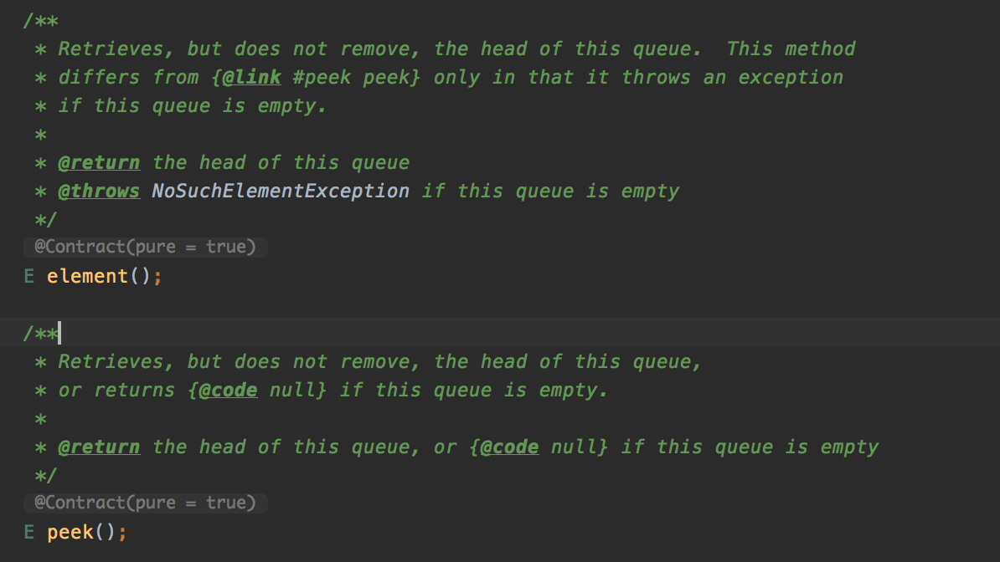
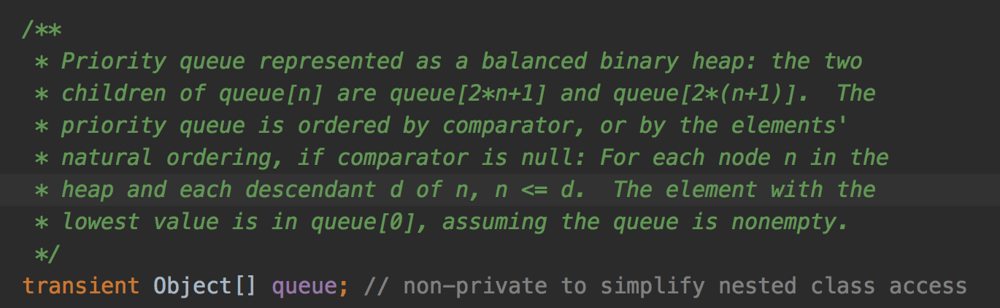
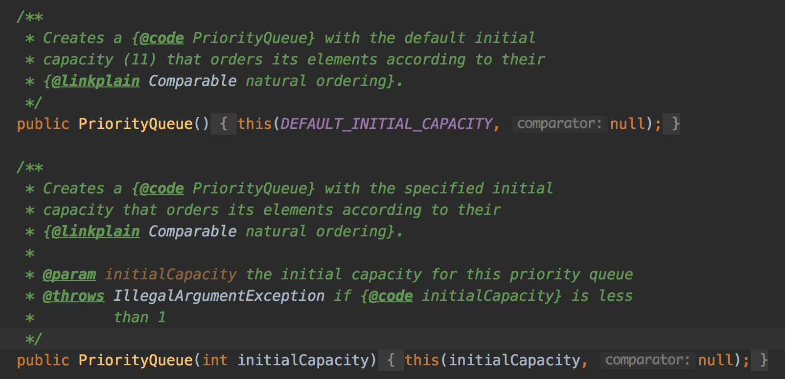
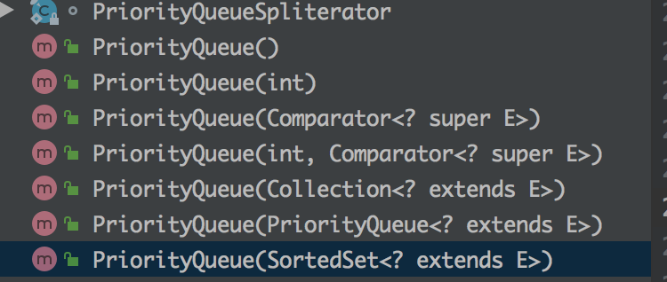
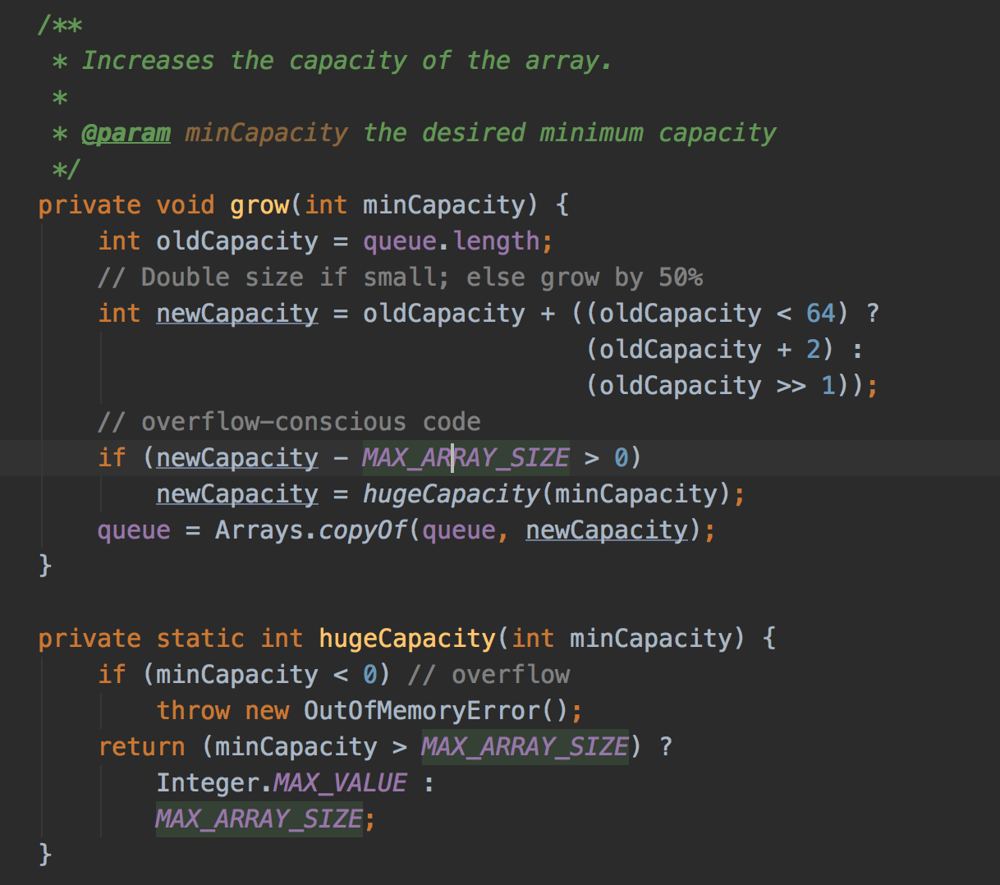
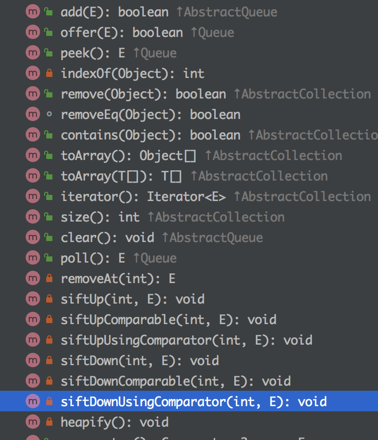

# 学习笔记

[Queue源码阅读](#Queue源码阅读)

[PriorityQueue源码阅读](#PriorityQueue源码阅读)

#### Queue源码阅读

😊😊😊😊😊😊😊😊😊😊😊😊😊😊😊😊😊😊😊😊😊😊😊😊😊😊😊😊😊😊😊😊😊😊😊😊😊😊

- Queue代码结构(java.util包中)

- 添加元素add()和offer()，其区别主要体现在对控制大小下的返回，当大小不够时，add()会抛出IllegalStateException异常，而offer()会直接返回false，源码如下

- 删除元素remove()和poll()类似，其主要区别是在空队列情况下的返回，源码如下

- 返回队列的头元素element()和peek()，其主要区别也是在空队列情况下的返回，源码如下

#### PriorityQueue源码阅读

😊😊😊😊😊😊😊😊😊😊😊😊😊😊😊😊😊😊😊😊😊😊😊😊😊😊😊😊😊😊😊😊😊😊😊😊😊😊

源码阅读相关信息：

- 优先队列(PriorityQueue)可以认为是一个平衡二叉堆（源码可以看到底层数组实现）；队列中元素的顺序是根据 comparator 比较得出的，如果 comparator 是 null ，则保持原始顺序；对于n的子节点d，n <= d；最小值在 queque[0]中，可认为队列是非空的。源码如下

  

- 优先队列默认大小是 11，可初始化设置大小，源码如下

  

- 初始化方式，如图

  

- 扩容，原始大小<64时，两倍+2；>64时，扩容原始大小的50%

  

- 优先队列的相关操作，可参考Queue的操作，以及如何进行操作进行排序建堆（未仔细看），具体操作如下，

  

- 其他序列化输入输出(writeObject/readObject)等
