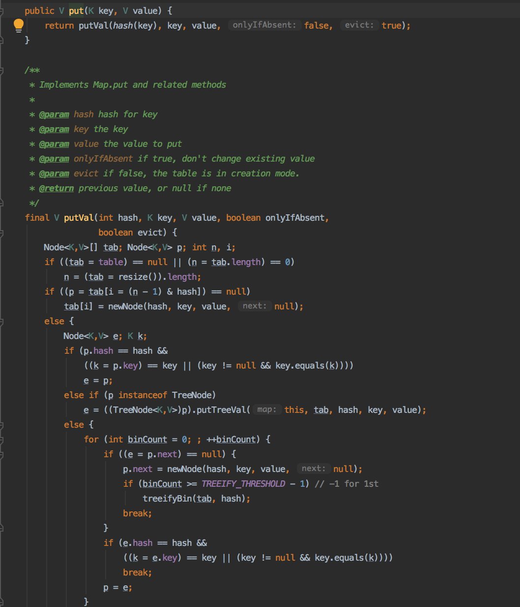
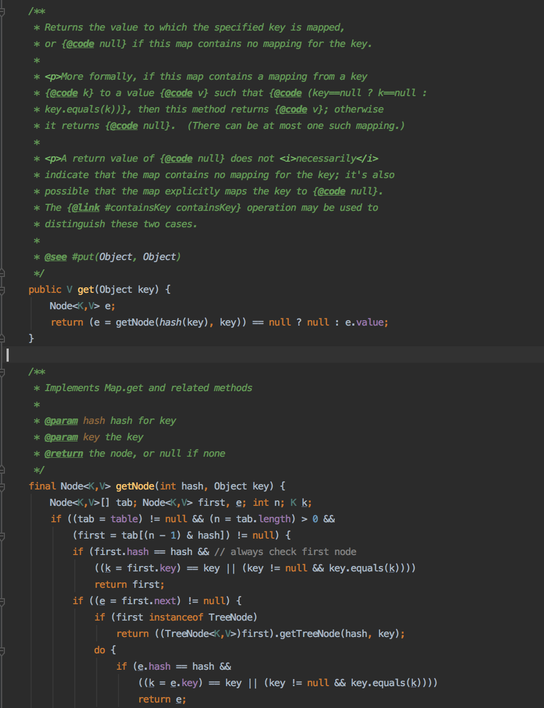

# 学习笔记

[HashMap源码小结](#HashMap源码小结)

[课堂提问](#问题)

#### HashMap源码小结

- put(K, V) 源码阅读
  
  

  如上图，put方法主要调用了 putVal 方法，主要分为以下步骤：
  
  1. 当存储元素的 table 为空时，则进行必要字段的初始化
  2. 如果根据 hash 值获取的节点为空时，则需要新建节点
  3. 红黑树的插入 **putTreeVal**
  4. 最后单链表的插入，若链表长度大于8时，则将链表转换为红黑树 **if (binCount >= TREEIFY_THRESHOLD - 1) treeifyBin
  5. 覆盖映射
  
- get(Object) 阅读阅读

  

  如上图，get方法也是主要调用了 getNode 方法，主要分为以下步骤：

  首先总是返回的第一个匹配的结果

  1. getTreeNode -- 树种查询
  2. 直接获取

#### 问题

> 树的面试解法一般都是递归，为什么

